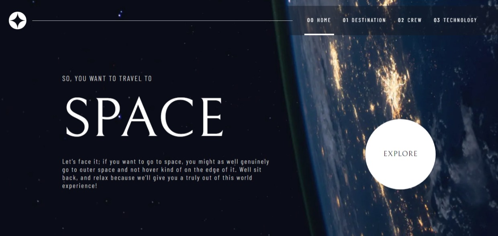

# Frontend Mentor - Space tourism website solution

This is a solution to the [Space tourism website challenge on Frontend Mentor](https://www.frontendmentor.io/challenges/space-tourism-multipage-website-gRWj1URZ3). Frontend Mentor challenges help you improve your coding skills by building realistic projects.

## Table of contents

- [Overview](#overview)
  - [The challenge](#the-challenge)
  - [Screenshot](#screenshot)
  - [Links](#links)
- [My process](#my-process)
  - [Built with](#built-with)
  - [What I learned](#what-i-learned)
- [Author](#author)

## Overview

Built with Next13 using the App directory, React Server Components and TailwindCSS

### The challenge

Users should be able to:

- View the optimal layout for each of the website's pages depending on their device's screen size
- See hover states for all interactive elements on the page
- View each page and be able to toggle between the tabs to see new information

### Screenshot



### Links

- Solution URL: [Github](https://github.com/Unidade/space-tourism-website-main)
- Live Site URL: [Vercel](https://your-live-site-url.com)

## My process

### Built with

- Semantic HTML5 markup
- CSS custom properties
- Flexbox
- CSS Grid
- Mobile-first workflow
- [React](https://reactjs.org/) - JS library
- [Next.js](https://nextjs.org/) - React framework
- [TailwindCSS](https://tailwindcss.com/) - For styles

**Note: These are just examples. Delete this note and replace the list above with your own choices**

### What I learned

I learned how to use nextjs Image Otimization with art direction, to efficiently only download the right image based on the viewport of the user

```js
// components/AdaptiveImage.tsx
export const AdaptiveImage = ({
  priority = true,
  sizes = "100vw",
  placeholder = "blur",
  fill = true,
  alt = "Hero Image",
  tabletImage,
  desktopImage,
  quality = 75,
  mobileImage,
  className,
  style = {
    objectFit: "cover",
  },
  ...props
}: AdaptiveImageProps) => {
  const common = { alt, fill, sizes, priority, className, style, ...props }

  const { srcSet: mobileSrcSet, ...rest } = getImgProps({
    ...common,
    src: mobileImage,
  }).props

  const { srcSet: tabletSrcSet } = getImgProps({
    ...common,
    src: tabletImage,
  }).props

  const { srcSet: desktopSrcSet } = getImgProps({
    ...common,
    src: desktopImage,
  }).props

  const mobileMedia = `(max-width: 639px)`
  const tabletMedia = `(min-width: 640px) and (max-width: 1023px)`
  const desktopMedia = `(min-width: 1024px)`

  return (
    <>
      <picture className={className}>
        <source media={desktopMedia} srcSet={desktopSrcSet} />
        <source media={tabletMedia} srcSet={tabletSrcSet} />
        <source media={mobileMedia} srcSet={mobileSrcSet} />
        
      </picture>
    </>
  )
}

```

I also used cookies to save the state on the Destination page to solve the issue of flashing the wrong default selection. When I tried using LocalStore the first render was always wrong because the Client Component still rendered on the server, and without the localStorage available there only when the Javascript was loaded on the client-side the destination page changed to the previous selected destination, causing a flash of out-sync content. Using cookies solved this issue

## Author

- Website - [Dario Rodrigues](https://dariorodrigues.me/)
- Frontend Mentor - [@Unidade](https://www.frontendmentor.io/profile/Unidade)
- Twitter - [@unidade_dev](https://twitter.com/unidade_dev)
